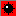

<h2 align="left" style="text-decoration: underline"> Игра «Сапёр» 💣</h2>

<h3 align="left">🌐 Ссылкa на игру</h3>
<a href="https://sapper-mu.vercel.app/" style="cursor: pointer">https://sapper-mu.vercel.app/ </a>

<h3 align="left">🙂 Введение</h3>
Игра запускается по указанной выше ссылке, для локального запуска необходимо слонировать репозиторий в удобное место (git clone) .

<h3 align="left">🏁 Правила игры</h3>
Плоское игровое поле разделено на смежные квадратные ячейки  , размер поля 16х16 ячеек. За некоторыми ячейками
скрываются мины .
Всего 40 «заминированных» ячеек. Целью игры является открытие всех ячеек, не 
содержащих мины.

Игрок открывает ячейки, стараясь не открыть ячейку с миной. Открыв ячейку с миной, он проигрывает. Игрок не может 
проиграть на первом ходу. Если под открытой ячейкой мины нет, то в ней появляется число, показывающее, сколько ячеек, 
соседствующих с только что открытой, «заминировано». Таким образом максимальная цифра - 8 , когда заминированы все 
соседствующие с открытой ячейки. Если под соседними ячейками тоже нет мин, то открывается некоторая «не заминированная» 
область до ячеек, в которых есть цифры, соответственно по соседству от которых мины есть. 
Используя числа, игрок пытается рассчитать расположение мин, однако иногда даже в середине и в конце игры некоторые 
ячейки всё же приходится открывать наугад. «Заминированные» ячейки игрок может пометить, чтобы случайно не открыть их.
Нажатие правой кнопкой на ячейке устанавливает флажек  и ячейка блокируется от случайного нажатия, повторное нажатие 
устанавливает знак вопрос , следующие нажатие разблокирует ячейку для выбора.
На прохождение игры дается 40 минут, по завершению времени игрок проигрывает.
При проигрыше игроку открываются все заминированные ячейки .
Открыв все «не заминированные» ячейки, игрок выигрывает .
Над игровым полем имеется "смайлик" , по нажатию на который игра перезапускается и меняется расположение "заминированных" 
ячеек.

<h3 align="left">🤔  Планы по совершенствованию игры</h3>
<ul>
<li>
Реализация принципов ООП
</li>
<li>
Разбитие на компоненты с использованием React
</li>
<li>
Применение Redux для изменения состояний
</li>
<li>
Применение Sass для унификации стилей
</li>
<li>
Совершенствование графического отображения - добавления теней, градиентов и т.д.
</li>
<li>
Использование Prettier для устранения ошибок
</li>
<li>
Использование Prettier для устранения ошибок
</li>
<li>
Тестирование
</li>
</ul>

<h3 align="left">👨‍🔬  Стек примененных технологий</h3>

